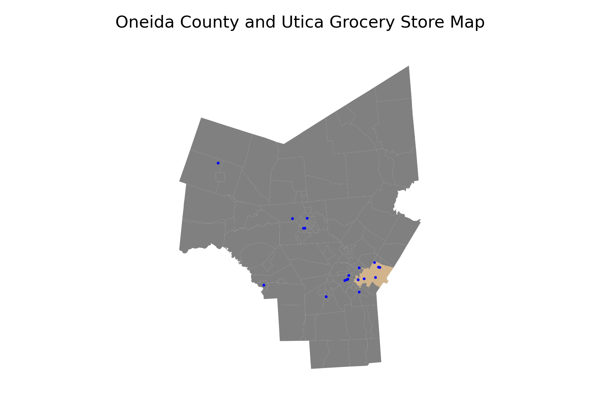
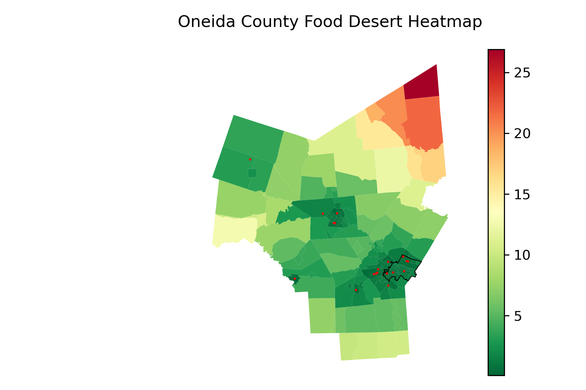
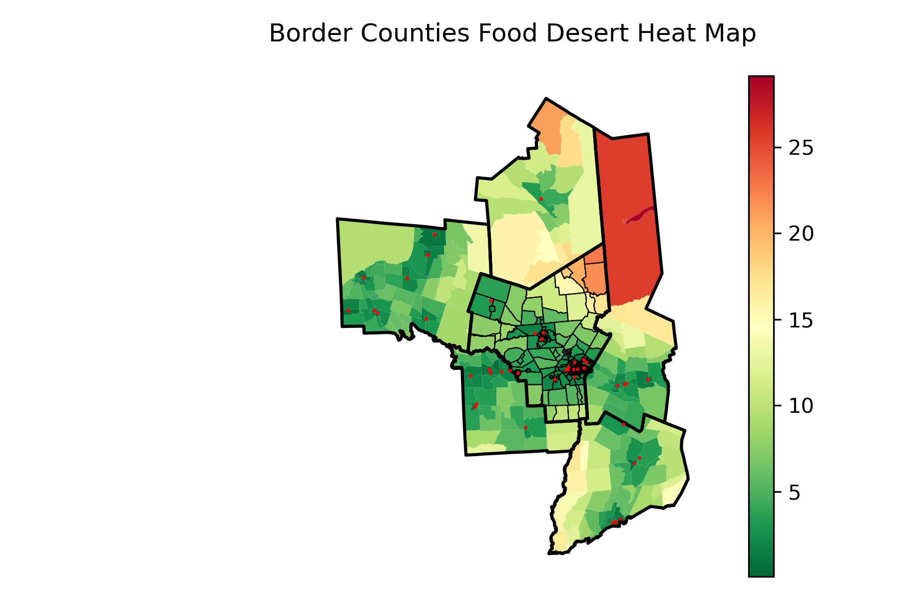
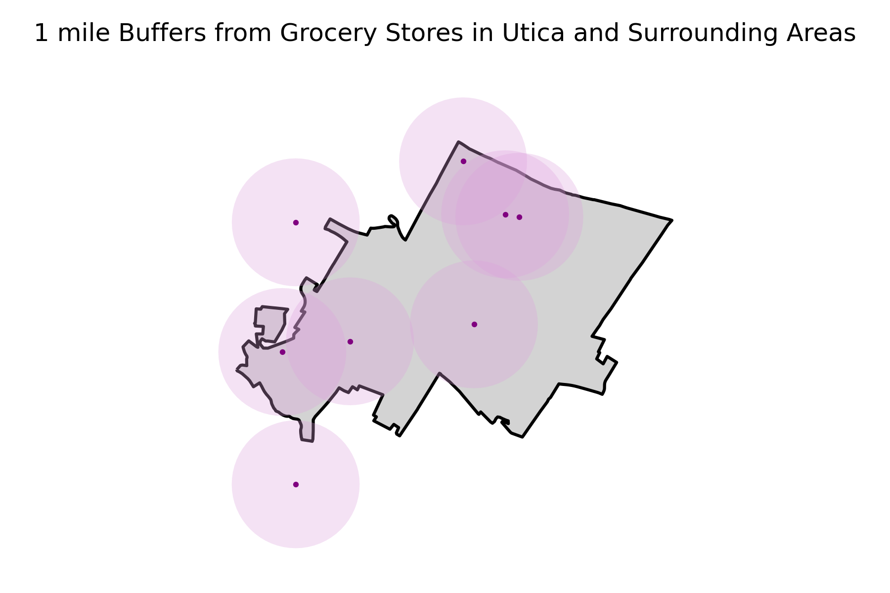
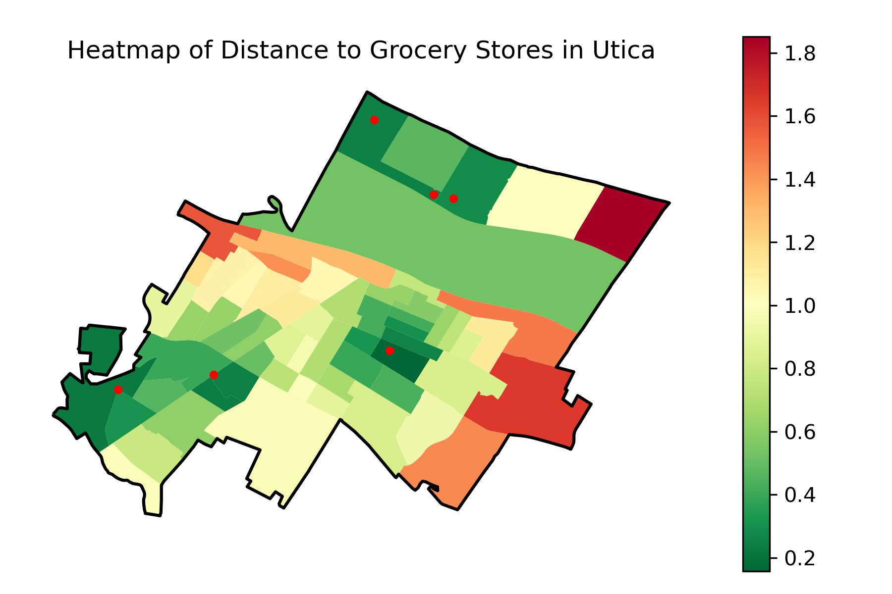
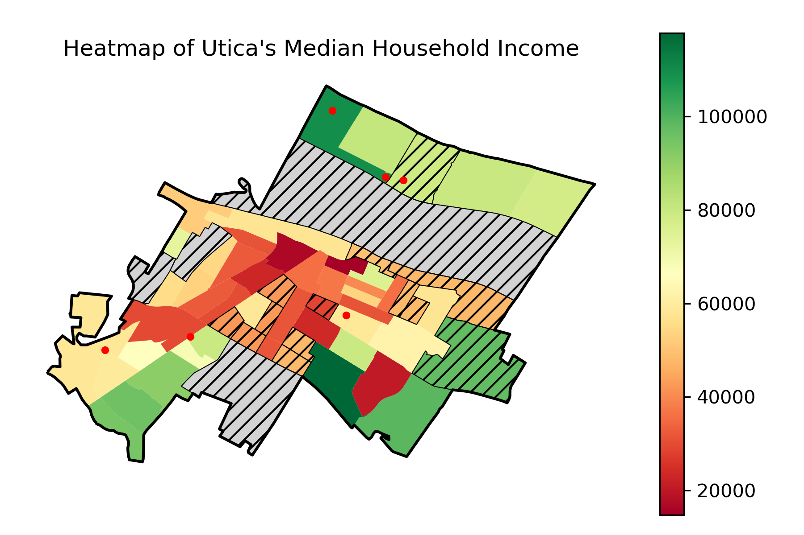
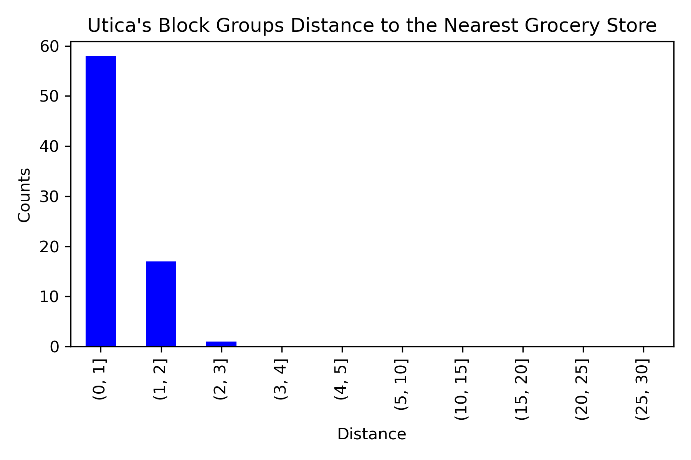
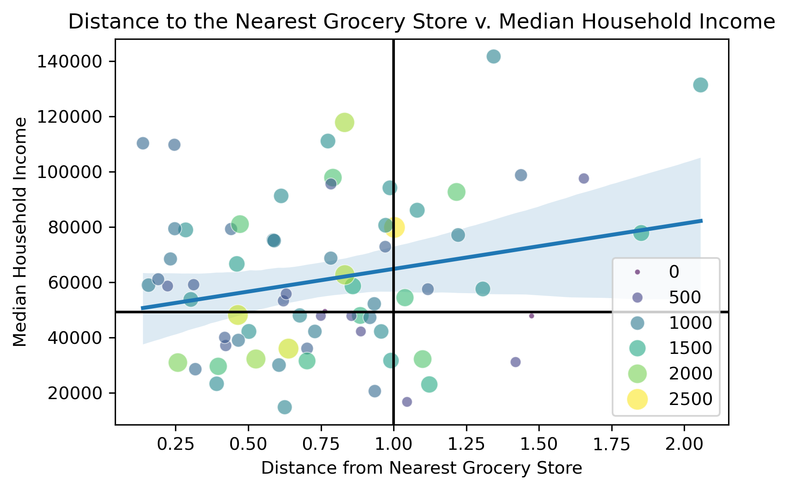

# Utica_Food_Deserts
This repository will analyze and map out grocery stores access for residents living in Utica and the wider Oneida County, identifying the presence of food deserts and determining whether their presence disproportionately affects low- income communities. 

# Data Sources
|Dataset|Defintion|Source|
|-------|---------|------|
|Retail_Food_Stores.csv|List of all retail food stores licensed by the NYS Department of Agriculture and Markets.|https://data.ny.gov/Economic-Development/Retail-Food-Stores/9a8c-vfzj/about_data|
|tl_2025_36_bg.zip|Utica’s Block Groups (Census Boundary Shapefiles)|https://www.census.gov/geographies/mapping-files/time-series/geo/tiger-line-file.html|
|tl_2025_36_place.zip|Utica’s City Boundary (Census Boundary Shapefiles)|https://www.census.gov/geographies/mapping-files/time-series/geo/tiger-line-file.html|
|income_by_bg.csv|Utica’s population in 2024|Pulled directly from API|
|income_by_bg.csv|Utica’s median household income in 2024|Pulled directly from API|

# Scripts
Below is the list of scripts that were used in the project which should be run in the following order: 
1. **[cleanapi.py](cleanapi.py)**
    - This script was designed to pull data from the Census through api. This includes block group data regarding median household income and population for Oneida County. For the income, the tract data was also pulled, which replaced any missing income data on the block group level. The filtered down data was placed into their respective CSV files. 
2. **[dataclean.py](dataclean.py)**
    - This script was built to clean the imported Census data. It filters down the data to include only the block groups from Utica, Oneida county, and its surrounding counties. This includes Herkimer County, Madison County, Lewis County, Oswego County, and Otsego County. It also filters down the retail food store to only include the bigger stores from these areas and remove any gas stations. The filtered down data was placed into their respective geopackages. 
3. **[desertmaps.py](desertmaps.py)**
    - This script utilizes the geopackages that were built in Script 2 to create maps and heatmaps of Oneida County and its surrounding counties. These maps display the location of the grocery stores, and the heatmaps color coordinate the block groups that are closest and farthest from these stores using green and red colors. 
4. **[uticamaps](uticamaps.py)**
    - This script utilizes the geopackages from Script 2 and the CSV files from Script 1 to build maps and heatmaps of Utica. These maps display the location of the grocery stores and the heatmaps color coordinate the block groups based on income levels and distance from the nearest grocery store. One of the maps also places 1 mile buffer rings around Utica’s grocery stores, calculating the populations that are within and outside the rings. 
5. **[desertcharts.py](desertcharts.py)**
    - This script uses the geopackages that were built in Script 2 and the CSV files from Script 1 to build data visualizations. It measures the distance that each block group is from the nearest grocery store and plots it into a bar chart. It uses this distance data along with the block group income data to create a scatterplot between the two variables. The size of the scatter dots reflects the size of the block groups. 

# Research Question
Question: Whether there is a negative correlation between grocery store access and low-income households in Utica, New York?  

# Purpose
This project aims to investigate the presence of Utica’s “Food Deserts,”or areas where households would have to travel more than a mile to purchase groceries. It will also investigate whether the presence of food deserts is more prevalent in low-income communities.  Through geographic mapping, this project will determine grocery access and its effects on the low-income.  

# Background
The term “food desert” was first coined by the Scottish Nutrition Task Force in 1995 (Karpyn, et al., 2019). It refers to an area “with limited access to [grocery stores with] affordable and nutritious food, particularly… an area composed of predominantly lower-income neighborhoods,” according to the Food Conservation and Energy Act (Congressional Research Service, 2021). These food deserts can be classified as low-income areas where at least 500 people or 33% of the population is living more than 1 mile (urban areas) or 10 miles (rural areas) from a grocery store (Congressional Research Service, 2021). By mapping these areas, we can identify the presence of food deserts in Utica, and support initiatives to improve food access to underserved communities.  

# Important Caveat: 
When the income data was pulled from the block group level, there were many block groups that were missing data. Thus, the income data was pulled from the tract group level and used for the block groups that did not have data. By doing this, we are assuming that the median household income is equal on the tract and block group levels. For these block groups that used tract income data, they are categorized by their respective heatmap colors and black lines in the image: “uticaincomeheatmap.png.” While the areas that did not have income data available on either level are categorized by a gray color and black lines.

# Analysis 

The map Oneida County illustrates that a majority of the grocery stores are clustered around or within the city of Utica. A heatmap of Oneida County resident’s distance from a grocery store categorizes Utica in the “green zone,” suggesting that its residents live close to grocery stores. This is also confirmed by a larger scale heatmap of Oneida and its border counties. 

However, upon further investigation, a detailed map of Utica’s grocery stores shows that there are many areas where Utica residents are not within one mile of a grocery store. The image “uticabuffers.png” maps out Utica and its grocery stores, with 1 mile buffer rings surrounding the stores. It also includes grocery store stores that are within 1 mile of Utica’s border. From this image, it is evident that West Utica, East Utica, and Northeast do not have adequate access to grocery stores. There are 51,065 people that live within these 1 mile buffer rings, and 13,151 people that live outside which makes up 25.75% of the population. The households that live outside of the rings are in danger of living in a food desert. The heatmap of Utica’s Food Deserts places these food desert areas in the orange, red, and dark red zones. This indicates that residents living in these areas are between 1.4-1.8 miles away from the nearest grocery store. When looking at a heatmap of Utica’s median household income, West Utica appears to be largely low-income, categorized by the orange to red colors. East and Northeast Utica appear to belong to middle-high income communities, categorized by the light to dark green colors on the map. Since West Utica is a low income area, likely to have more than 500 residents, and is more than 1 mile away from a grocery store, it can be categorized as a food desert. 

Based on the bar chart information, there are 58 block groups that are between 0-1 miles away from the nearest grocery store. These blockgroups are considered to live close to a grocery store. 17 block groups are between 1-2 miles away and 1 block group is 2-3 miles away from the closest grocery store. These block groups are considered to be the food desert danger zones, due to their far distances from grocery stores. After regressing median household income onto the block groups distance from grocery stores, there is a positive correlation between the two variables. This entails that the more income a household earns, the farther away they will live from a grocery store. The scatterplot showcases this correlation with a black horizontal line at $49,250 representing the low-income poverty line and a black vertical line at the 1 mile distance mark. Block groups that are to the left of the vertical line are not going to be classified as food deserts, given their proximity to grocery stores. The block groups above the poverty line and to the right of the 1 mile vertical line will also not be classified as food deserts, given the block groups higher income status. The block groups that are below the poverty line and right of the 1 mile mark, will be classified as a food desert since they represent low income households that are more than 1 mile away from a grocery store. 

# Conclusion 
In conclusion, this study found that Utica does have food deserts present in low-income communities, primarily in West Utica. This result can be utilized to counter food insecurity present in these areas through improved food access. The study also concluded the presence of a positive correlation between distance from grocery stores and median household income, meaning that high income earners are more likely to live farther away from grocery stores. Moving forward, this project can serve as the foundation for further research that incorporates car ownership and bus routes, creating a better picture into grocery store accessibility. 

# Academic 
- Congressional Research Services, (2021, June 1), Defining Low-Income, Low-Access Food Areas (Food Deserts), [Link](https://www.congress.gov/crs_external_products/IF/PDF/IF11841/IF11841.1.pdf)
- Karpyn, A., et al. (2020, June 17), The changing landscape of food deserts, UNSCN Nutr. 2019 Summer; 44:46–53, [Link](https://pmc.ncbi.nlm.nih.gov/articles/PMC7299236/)
- Rhone, A., (2025, January 5), Food Access Research Atlas - Documentation, U.S. Department of Agriculture Economic Research Service, [Link](https://www.ers.usda.gov/data-products/food-access-research-atlas/documentation#:~:text=Low%2Dincome%20and%20low%2Daccess%20tract%20measured%20at%201%20mile,Dimensions%20TDLinx%20directory%20of%20stores.)
- U.S. Department of Hud, (2024), 2024 Adjusted Home Income Limits, [Link](https://www.huduser.gov/portal/datasets/home-datasets/files/HOME_IncomeLmts_State_NY_2024.pdf)
